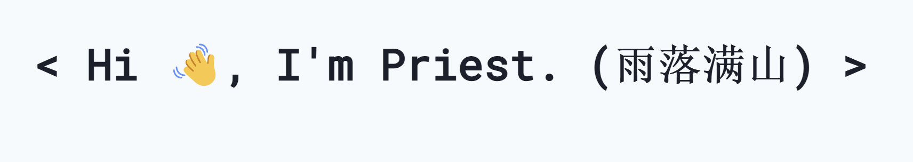

<h1> Nice to see you！</h1>

<h1>🔭 About Me</h1>

**·** 👯 You can call me rainny, I'm XJTLU Y3 student, study in Su Zhou.

**·** 🌱 Fresh learner about multimoding LLM.

**·** 🐋 Datawhale Research assistance.

**·** 👨‍💻 Language: Python, C++, JavaScript.

**·** 📧 Connect with me: Priest_cr@163.com

<h1>✨Interest</h1>

Model distillation: 

NLP:

<h1>Experience:</h1>

[ Open 1+X AI 通识课:](https://www.datawhale.cn/open-ai) Core contributor. Joined designed Agent chapter, the general course is **the first AI general course in China jointly** created by the head open source community and top universities.

[High frequency trading:]() Based on the transformer, designed and tunning model to predictly High frequency trading, get 95% accuarcy and low F1 score.

